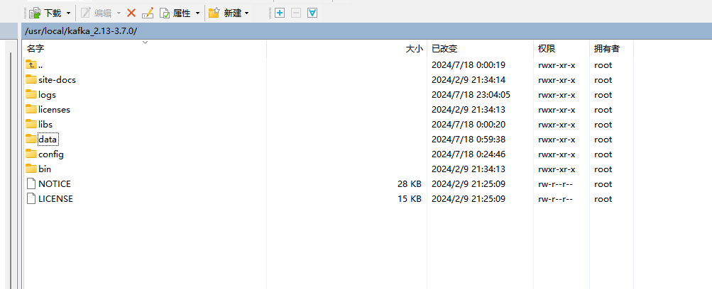

# kafka集成

## 	云服务器下载并安装kafka：

​	**官网**：[http://kafka.apache.org/downloads]

​    **注意：**Kafka自从0.8.2版本起，就开始自带了ZooKeeper，对于生产环境，建议使用独立的ZooKeeper集群，而不是Kafka自带的ZooKeeper。
​				如果使用高版本kafka就不用单独下载zookeeper，只限于测试demo，低版本就需要单独安装zookeeper。以下使用的是kafka自带的zookeeper安装。

**安装完目录结构：**

## 	服务器kafka相关的配置文件（config目录下）：

- **zookeeper.properties** ： zookeeper配置

  重要属性配置：

  - dataDir=/tmp/zookeeper	数据卷

  - clientPort=2181    客户端端口

    一般默认配置即可

- **server.properties** ： kafka配置

  - broker.id=0

  - log.dirs=/usr/local/kafka_2.13-3.7.0/data/kafka/logs    kafka运行数据日志

  - num.partitions=1    默认分区数

    ###### 云服务器-配置服务器局域网ip 和公网ip

  - listeners=PLAINTEXT://10.2.8.15:9092 

  - advertised.listeners=PLAINTEXT://42.193.112.54:9092

    

- **producer.properties** ： 生产者配置

- **consumer.properties** ： 消费者配置

  相关修改及字段含义可从网上找一下

  ## 启动相关脚本（bin目录下）

  **zookeeper-server-start/stop.sh**     启动zookeeper脚本：./zookeeper-server-start/stop.sh  -daemon  ../config/zookeeper.properties

  **kafka-server-start/stop.sh**    启动kafka脚本:  ./kafka-server-start/stop.sh  -daemon  .../config/server.properties

  kafka-console-producer.sh

  kafka-console-consumer.sh 

  ## SpringBoot集成Kafka

  maven依赖：

  ```maven
  <!-- 如果spring-kafka报错缺少kafka-clients依赖，就加上 -->
  <dependency>
      <groupId>org.apache.kafka</groupId>
      <artifactId>kafka-clients</artifactId>
      <version>${kafka-clients.version}</version>
  </dependency>
  
  <dependency>
      <groupId>org.springframework.kafka</groupId>
      <artifactId>spring-kafka</artifactId>
      <version>${kafka.version}</version>
  </dependency>
  ```

  application.yml

  ```yml
  spring:
    kafka:
      bootstrap-servers: 42.193.112.54:9092
      consumer:
        auto-offset-reset: earliest
  server:
    port: 9999
  ```

​		生产者demo：

```java
package com.chenjw.producer;

import org.springframework.kafka.core.KafkaTemplate;
import org.springframework.kafka.support.SendResult;
import org.springframework.scheduling.annotation.Scheduled;
import org.springframework.stereotype.Component;
import org.springframework.util.concurrent.ListenableFuture;

import javax.annotation.Resource;

@Component
public class ProducerDemo {

    @Resource
    private KafkaTemplate<String, String> kafkaTemplate;


    @Scheduled(cron = "*/5 * * * * ?")
    public void kafkaSendTest(){
        final ListenableFuture<SendResult<String, String>> future = kafkaTemplate.send("testFirstTopic", "test-first111111");
        future.addCallback(o -> System.out.println("succ"), throwable -> System.out.println("failure"));
    }

}
```

消费者demo：

```java
package com.chenjw.consumer;


import org.springframework.kafka.annotation.KafkaListener;
import org.springframework.stereotype.Component;

@Component
public class ConsumerDemo {

    @KafkaListener(topics = {"testFirstTopic"}, groupId = "123")
    public void receive(String message){
        System.out.println("接收到的消息："+message);
    }
}
```

启动项目

**ProducerDemo**的定时任务**kafkaSendTest**每五秒产生一条消息

**ConsumerDemo**通过**@KafkaListener**注解配置监听消费生产者的消息并打印在控制台


***ok，剩下的就是具体的业务怎么去生产和消费消息了，以及对应业务需要的一系列的kafka的配置项怎么配置的问题***