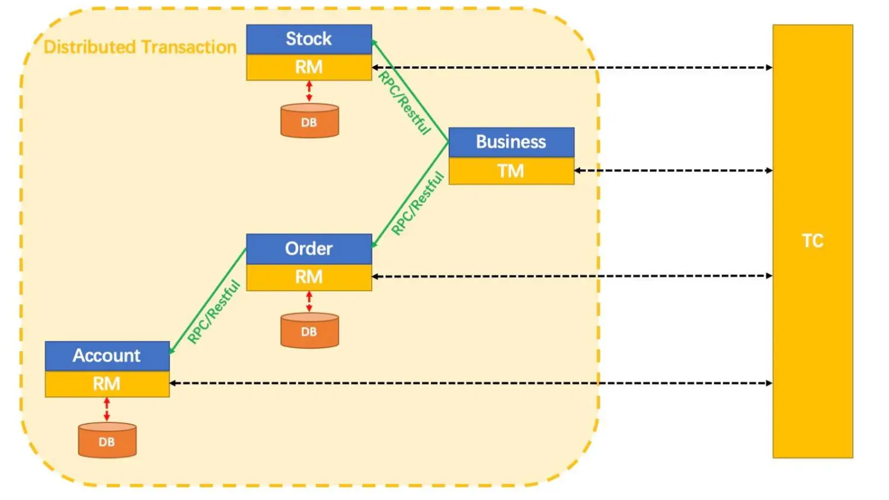
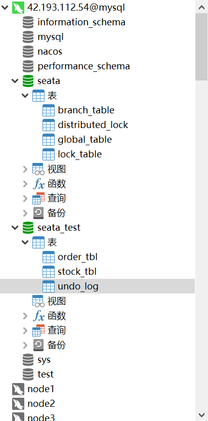

分布式事务理论分别为CAP定律和BASE理论

1. CAP
    CAP由三个英文单词首字母组成，分别为：Consistency（一致性）、 Availability（可用性）、Partition tolerance（分区容错性）
    
    C（一致性）：在分布式系统中，所有数据备份是否在同一时刻都是相同的
    A（可用性）：在集群某个节点故障后，整体能否响应客户端的读写请求
    P（分区容错性）：由通信带来的时限要求。在时限达到后，还未达成数据一致性，那么必须在C和A之间做出选择，要么快速响应客户端，要么保证达成数据一致后再响应客户端，后者可能永远无法响应
    CAP定律证实：分布式事务由于网络等原因出现P后，只能够做到CP或AP，无法做到三者同时满足

2. BASE
    BASE理论是基于CAP定律发展而来的，由于CAP的强一致性太苛刻了，BASE理论核心思想是：即使无法做到强一致性，但每个应用都可以根据自身业务特点，采用适当的方式来使系统达到最终一致性。
    
    BASE理论由三个英文短语组成：
    
    Basically Available（基本可用）：
    1.响应时间上，允许有一定时间的延迟
    2.系统功能上，允许服务降级的发生
    Soft state（软状态）：
    允许系统中的数据存在中间状态，并这种状态不影响整体可用性。即允许数据副本同步过程有一定的延迟
    Eventually consistent（最终一致性）：
    所有的数据副本，在经过一段时间同步后达到相同

Seata是提供处理分布式事务解决方案的一个组件，官网：https://seata.io/zh-cn/docs/overview/what-is-seata.html
Seata安装
下载最新版本：https://github.com/seata/seata/releases

1. 2PC
    2PC就是两阶段提交协议，将整个分布式事务分为两个阶段：
    
    P（准备阶段）：由事务管理器通知每个事务成员执行本地事务，并形成Undo/Redo日志，Undo日志是记录修改前的日志，用于回滚操作，Redo日志是记录修改后的日志，用于提交操作
    C（提交阶段）：如果某个事务成员响应超时或失败，那么事务管理器通知每个成员回滚，如果全员通过，那么通知提交；由每个事务成员根据事务管理器的具体通知执行提交还是回滚，并释放资源

2. Seata三大角色
    Seata也是基于2PC协议，并在2PC基础上进一步抽象，将分布式事务种的成员分为三个角色：
    
    TC（Transaction Coordinator）- 事务协调者：
    维护全局和分支事务状态，通知各成员全局事务的提交或回滚
    TM（Transaction Manager）- 事务管理器：
    发起全局准备事务、全局提交或回滚事务，交由TC处理
    RM（Resource Manager）- 资源管理器：
    分支事务具体参与者，注册和通知TC分支事务状态，TM也是RM
   

3. Seata支持的模式

    模式	描述	侵入性
    AT	使用最多的模式，基于2PC协议，准备阶段生成undo日志，根据提交阶段提交/回滚，删除undo或使用undo回滚	无
    XA	基于数据库的XA协议实现2PC，只有全局事务完成，数据才会真正更新到数据库表中，强调事务一致性时使用	无
    TCC	自定义准备阶段，以及提交/回滚阶段的行为，可以针对不仅仅是数据库资源的分布式事务	高
    Saga	单个事务失败后，可以补偿前面的成功者，具体补偿行为由自定义业务处理，针对长事务时使用	高
    
seata测试数据库相关表，具体表结构官方提供了建表语句(undo_log没有，不知这个表是自己创建还是？)：https://github.com/seata/seata/tree/develop/script/server/db

Seata项目各种配置完毕后本身要加入到服务注册中心去(如nacos)，且也可使用配置中心的功能提供配置(如nacos中seataServer.properties);

4. Seata-AT
    AT是使用最广泛的模式，Seata-AT模式会自动生成事务的二阶段提交和回滚操作，具体流程为：
    
    第一阶段
    1.TM发起准备事务，执行本地事务并远程调用RM方法
    2.TC拦截业务SQL，并解析SQL，在数据更新前，在TM/RM本地undo_log表中生成对应的Undo日志
    3.TM/RM执行本地事务，数据更新，并形成行锁，防止其他事务修改
    第二阶段
    根据第一阶段是否有本地事务执行失败，如果有，发起回滚，TM/RM根据Undo日志执行反向更新操作；如果都执行成功，发起提交，TM/RM删除Undo日志和释放资源

5. @GlobalTransactional
    在Service层相应方法上使用@GlobalTransactional注解开启分布式全局事务;
    可通过测试得到结果:远程服务调用失败，数据库中的数据最终都回滚到了最初状态
